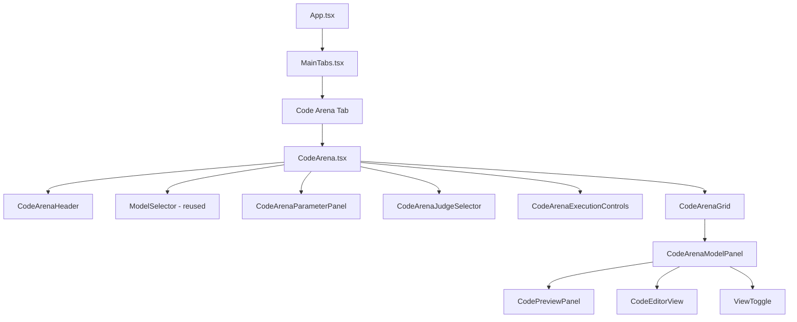
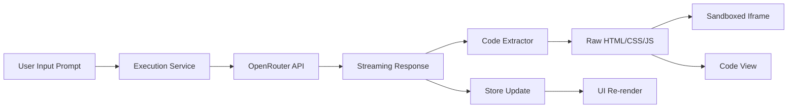
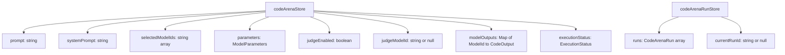

# Code Arena Implementation Plan

## Overview

Add a new "Code Arena" benchmark type to Benchmaker that enables real-time side-by-side comparison of different AI models generating frontend code (HTML+CSS+JS) with live preview rendering.

## Key Features

1. **Separate Tab**: New "Code Arena" tab alongside existing Arena
2. **Live Streaming Preview**: Real-time iframe rendering as models stream responses
3. **Individual Toggles**: Each model output has its own code/preview toggle
4. **Full JS Execution**: Sandboxed iframes with JavaScript enabled
5. **LLM Judge Only**: Optional judging limited to LLM-based evaluation (or no judge)
6. **Customizable System Prompt**: Default frontend coding prompt that users can modify
7. **Auto Code Extraction**: Automatically extract HTML from markdown code blocks

## Architecture

### Component Hierarchy



### Data Flow



### State Management



## New Types

```typescript
// Add to src/types/index.ts

export interface CodeArenaOutput {
  modelId: string
  rawResponse: string
  extractedCode: string
  status: ExecutionStatus
  error?: string
  latencyMs?: number
  promptTokens?: number
  completionTokens?: number
  cost?: number
  streamedContent?: string
  score?: ScoringResult
}

export interface CodeArenaRun {
  id: string
  type: 'code-arena'
  prompt: string
  systemPrompt: string
  models: string[]
  parameters: ModelParameters
  outputs: CodeArenaOutput[]
  status: ExecutionStatus
  startedAt: number
  completedAt?: number
  judgeModelId?: string
}
```

## New Files to Create

### Components

| File | Purpose |
|------|---------|
| `src/components/code-arena/CodeArena.tsx` | Main Code Arena container component |
| `src/components/code-arena/CodeArenaHeader.tsx` | Header with prompt input and system prompt editor |
| `src/components/code-arena/CodeArenaGrid.tsx` | Grid layout for model outputs |
| `src/components/code-arena/CodeArenaModelPanel.tsx` | Individual model output panel with toggle |
| `src/components/code-arena/CodePreviewPanel.tsx` | Sandboxed iframe for live HTML preview |
| `src/components/code-arena/CodeEditorView.tsx` | Syntax-highlighted code display |
| `src/components/code-arena/CodeArenaExecutionControls.tsx` | Run/Stop buttons |
| `src/components/code-arena/CodeArenaJudgeSelector.tsx` | LLM judge toggle and model selector |
| `src/components/code-arena/CodeArenaResults.tsx` | View past Code Arena runs |
| `src/components/code-arena/CodeArenaParameterPanel.tsx` | Model parameters for Code Arena |

### Stores

| File | Purpose |
|------|---------|
| `src/stores/codeArenaStore.ts` | Current Code Arena session state |
| `src/stores/codeArenaRunStore.ts` | Persisted Code Arena run history |

### Services

| File | Purpose |
|------|---------|
| `src/services/codeArenaExecution.ts` | Execution logic for Code Arena benchmarks |
| `src/services/codeExtractor.ts` | Extract HTML/CSS/JS from markdown responses |

### Scoring

| File | Purpose |
|------|---------|
| `src/scoring/code-arena-judge.ts` | LLM judge prompt for frontend code evaluation |

## Files to Modify

| File | Changes |
|------|---------|
| `src/types/index.ts` | Add CodeArenaOutput, CodeArenaRun types |
| `src/components/layout/MainTabs.tsx` | Add Code Arena tab |
| `src/services/localDb.ts` | Add Code Arena runs persistence |

## Implementation Details

### 1. Sandboxed Iframe Preview

The iframe will use the `srcdoc` attribute with sandbox permissions:

```tsx
<iframe
  srcDoc={extractedCode}
  sandbox="allow-scripts allow-same-origin"
  className="w-full h-full border-0"
  title={`Preview for ${modelId}`}
/>
```

### 2. Code Extraction Logic

```typescript
function extractCodeFromResponse(response: string): string {
  // Try to extract from markdown code blocks
  const htmlMatch = response.match(/```(?:html)?\s*([\s\S]*?)```/i)
  if (htmlMatch) {
    return htmlMatch[1].trim()
  }
  
  // Check if response starts with DOCTYPE or html tag
  if (response.trim().match(/^<!DOCTYPE|^<html/i)) {
    return response.trim()
  }
  
  // Wrap in basic HTML structure if just body content
  if (response.trim().match(/^<(?:div|section|main|header|body)/i)) {
    return `<!DOCTYPE html><html><head><meta charset="UTF-8"></head><body>${response}</body></html>`
  }
  
  return response
}
```

### 3. Default System Prompt

```
You are an expert frontend developer. Generate a complete, single-page HTML document with embedded CSS and JavaScript based on the user's request.

Requirements:
- Output ONLY the HTML code, no explanations or markdown
- Include all CSS in a <style> tag in the <head>
- Include all JavaScript in a <script> tag before </body>
- Use modern, semantic HTML5
- Make the design visually appealing and responsive
- Ensure the code is complete and functional
```

### 4. LLM Judge Prompt for Code Arena

```
You are evaluating frontend code generated by an AI model. Analyze the code and rendered output based on:

1. **Visual Accuracy** (40%): Does the output match the user's request visually?
2. **Code Quality** (30%): Is the code clean, semantic, and well-structured?
3. **Functionality** (20%): Does any JavaScript work correctly?
4. **Responsiveness** (10%): Does the layout adapt to different screen sizes?

User Request: {prompt}

Generated Code:
{code}

Provide a score from 0-100 and brief explanation.
Format: SCORE: [number]
EXPLANATION: [your analysis]
```

## UI Layout

### Code Arena Main View

```
+------------------------------------------------------------------+
|  Code Arena                                    [Run] [Stop]       |
+------------------------------------------------------------------+
|  System Prompt: [Editable textarea with default prompt]          |
+------------------------------------------------------------------+
|  Your Prompt: [What frontend would you like to create?]          |
+------------------------------------------------------------------+
|  Models: [Model selector - same as Arena]                        |
+------------------------------------------------------------------+
|  Parameters: [Temp] [TopP] [MaxTokens]    Judge: [Toggle] [Model]|
+------------------------------------------------------------------+
|                                                                   |
|  +---------------------------+  +---------------------------+     |
|  | Model A                   |  | Model B                   |     |
|  | [Code] [Preview]          |  | [Code] [Preview]          |     |
|  +---------------------------+  +---------------------------+     |
|  |                           |  |                           |     |
|  |   Live Preview/Code       |  |   Live Preview/Code       |     |
|  |                           |  |                           |     |
|  +---------------------------+  +---------------------------+     |
|  | Latency: 2.3s | Cost: $0.01 | Latency: 1.8s | Cost: $0.02|     |
|  +---------------------------+  +---------------------------+     |
|                                                                   |
+------------------------------------------------------------------+
```

## Execution Flow

1. User enters prompt and selects models
2. User clicks "Run"
3. For each selected model (in parallel with concurrency limit):
   - Send request to OpenRouter with system prompt + user prompt
   - Stream response chunks to store
   - Extract code from streamed content in real-time
   - Update iframe preview as code is extracted
4. When all models complete:
   - If judge enabled, run LLM judge on each output
   - Save run to codeArenaRunStore
   - Persist to localDb

## Security Considerations

1. **Iframe Sandbox**: Use `sandbox="allow-scripts"` to enable JS but restrict:
   - No access to parent window
   - No form submission
   - No popups
   - No top navigation

2. **Content Security**: The iframe uses `srcdoc` which isolates content from the main app origin

3. **Resource Limits**: Consider adding a timeout for infinite loops in generated JS

## Testing Considerations

- Test with various model outputs (clean HTML, markdown-wrapped, partial code)
- Test iframe rendering with complex CSS/JS
- Test streaming updates don't cause excessive re-renders
- Test judge scoring consistency
